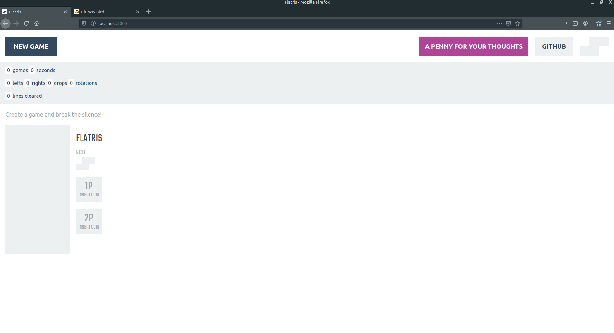

## Setup and running

```
git clone https://github.com/axyi/lesson_one.git
cd ./lesson_one
docker-compose up -d
```

Go to http://localhost:3000 for playing to Flatris

Go to http://localhost:8001 for playing to Clumsy Bird


## Flatris
[]

## Clumsy Bird
[]
